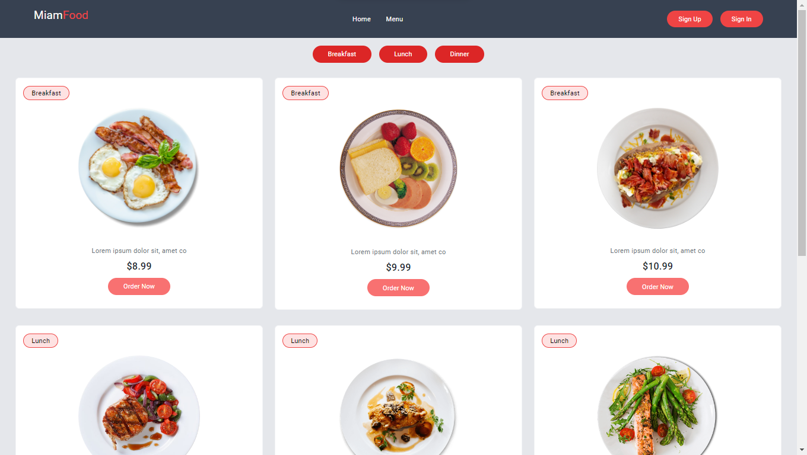
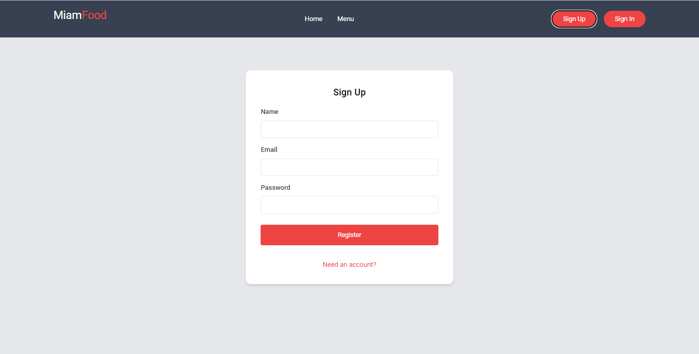
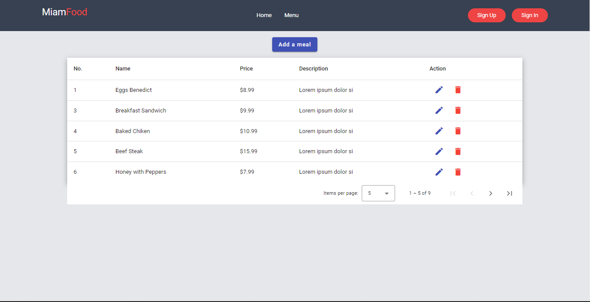
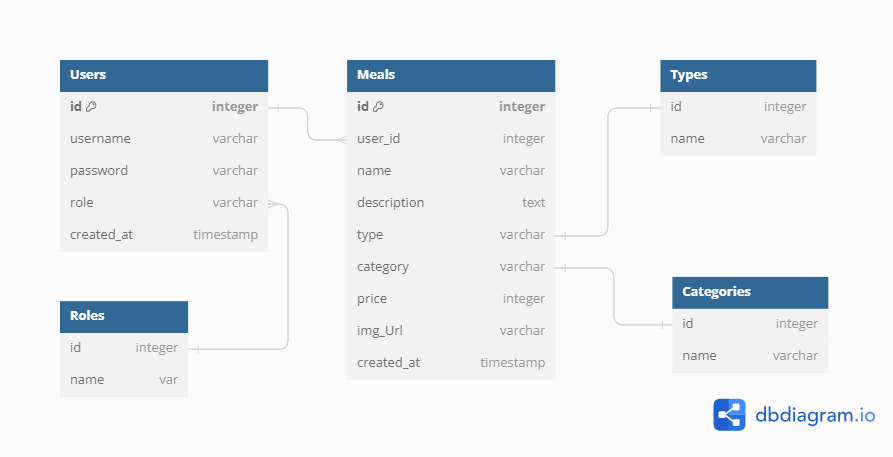

# A restaurant APP with NestJS and Angular

An application that allow a restaurant presentation and management

## User Flow

### User Registration/Login
- Register.
- Login.

### CRUD operations for the ower
- Login before performing those operation

## Required Endpoints

1. **Listings**
   - Provide an endpoint for meal presentation.
   
  
2. **User Registration/Login**
   - Implement authentication to allow users to register and log in.
    
3. **Crud Operations**
   - For owner.
	

## Technical Details
- **Front-end Framework:** Angular
- **Back-end Framework:** NestJS
- **Database:** PostgreSql

## Database Configuration
- host: 'localhost',
- port: 5432,
- username: 'postgres',
- password: 'password',
- database: 'restaurant_db' 

## Running the app 
- First create the database before run the following commands. You can use `db_population.json` file at the root to populate the database.
- Run `npm install` to install all the dependencies
- Run `npm dev serve` to lunch the front-end and the backen-end at the same time

